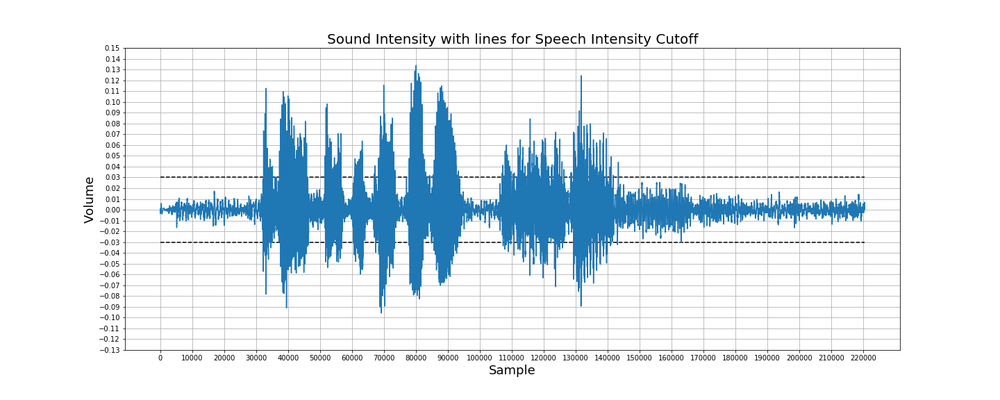
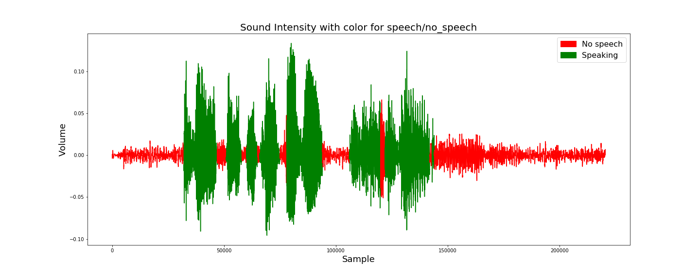
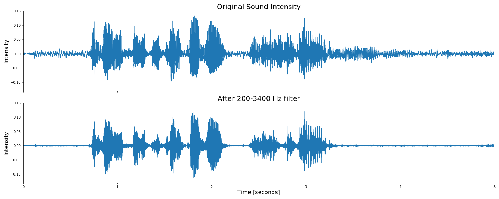
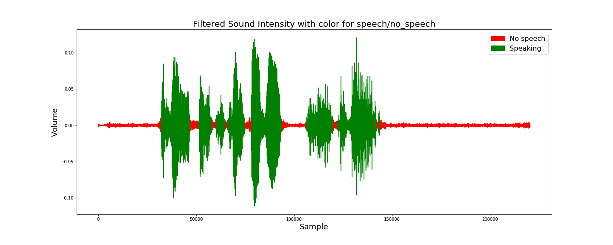
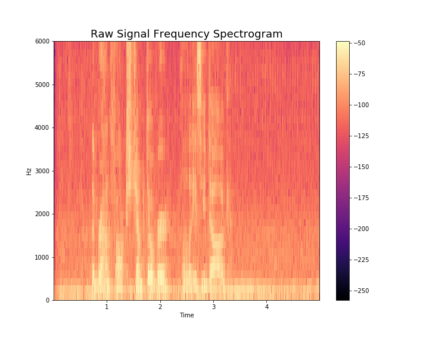
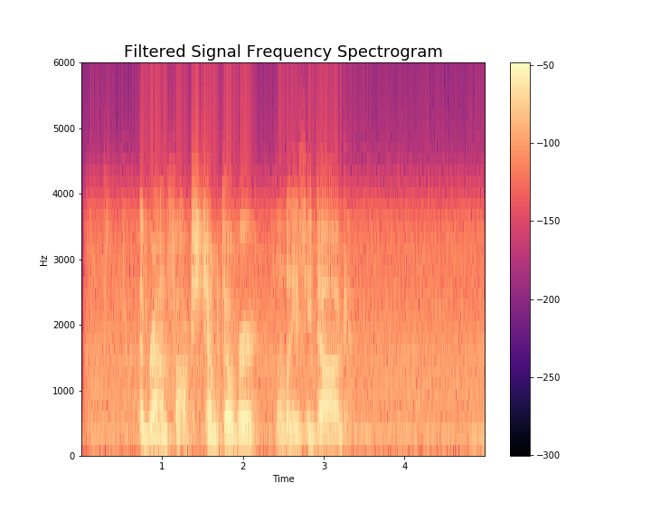

# Audio Visualization and Analysis
- This repo provides a brief introduction to manipulating audio files
- Open the Audio_File_Visualization_and_Classification.ipynb notebook for a guided walk-through
### We begin by graphing audio file
- It appears that the cutoff for speech is somewhere around the 0.03 intensity

- We will split audio file into speech and no speaking sections and color the graph accordingly

### Frequency Based Approach
- In this section, we will start by transforming to the frequency domain and applying a band pass filter for human speech (~200Hz-3400Hz). Then we will follow the same steps as above and take note of the difference.

- Next, we split the filtered audio file into speech and no speaking sections and color the graph accordingly

### Graph of frequency spectrogram to confirm filter function

- The filtered signal has a distinct cutoff at the 3400Hz range(less noticable is the thin purple cutoff below the 200Hz mark)

### More walkthroughs will be coming in the future that explore speaker classification and speech recognition
